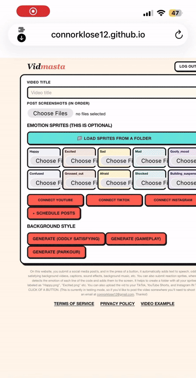
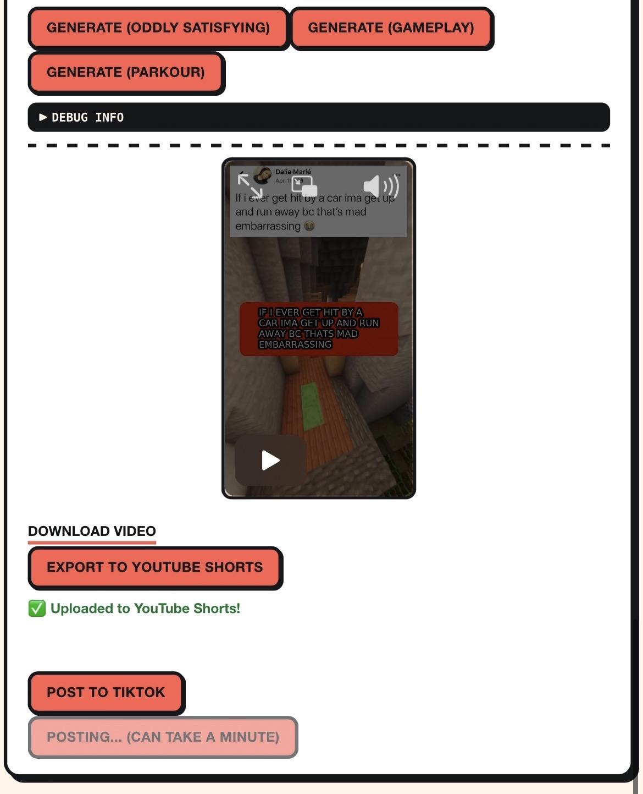
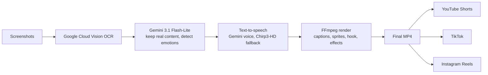

> [!IMPORTANT]
> **THE LATEST VERSION OF FINALPRODUCT IS THE MOST RECENT UPDATE**
>
> Use the `FINALPRODUCT` branch for the newest code.

# Vidmasta

**Input an image, get a finished short-form video with advanced automated AI editing. Then post it to TikTok, YouTube Shorts and Instagram Reels in a button from the site, or schedule many posts at once.**

<p>
  
  
  
  
  
</p>

<table>
  <tr>
    <td align="center" valign="top">
      
      <br/><sub><b>A video it made</b></sub>
    </td>
    <td align="center" valign="top">
      
      <br/><sub><b>The app</b></sub>
    </td>
  </tr>
</table>

**Try it:** <https://connorklose12.github.io/vidmasta/> (posting to social accounts is in testing mode)

## What it does

Upload screenshots of a post and it builds the video for you.

- **Reads the post.** OCR plus Gemini throw away usernames, timestamps and buttons, so only what people actually wrote gets narrated.
- **Narrates it with feeling.** Every line gets one of 10 emotions, which changes how the voice speaks and which reaction sprite shows up.
- **Looks like the real thing.** Word-by-word captions, a hook up front, sound effects, a color tint and a screen shake on the big moments, all over gameplay, parkour or satisfying footage.
- **Posts for you.** One click to each platform, or schedule posts across the next 7 days and let it run.

## How it works



## Problems I had to solve

| Problem | What I did |
|---|---|
| Long posts rendered slowly | FFmpeg runs every filter on every frame, so I split long posts into 3 clips and stitch them back together with no visible seam. |
| Cloud Run rejects requests over 32 MiB | Scheduled photos upload one at a time, and publishing sends a job ID instead of re-uploading the video. |
| A scheduled post could go out twice | Each post is claimed in a Firestore transaction before any work starts, so overlapping runs can't double-post. |
| AI services go down or get busy | Gemini retries when overloaded. The voice falls back to Chirp3-HD, and the screenshot filter falls back to plain rules. |
| The hook had to land on the beat | The code measures the sound effect's volume and lands the animation on its hit, within one video frame. |
| TikTok's review rules | I built the posting screen to TikTok's Content Sharing Guidelines: creator nickname, no-default privacy picker, disclosure labels and consent text. |

## Tech stack

| | |
|---|---|
| **Frontend** | Angular (TypeScript), Firebase Auth, GitHub Pages |
| **Backend** | Node.js, Express, FFmpeg, Google Cloud Run |
| **AI and voice** | Gemini (screenshot filtering, emotions, voice), Claude (hook line), Google Cloud Vision (OCR) |
| **Data and jobs** | Firestore, Cloud Storage, Cloud Scheduler |
| **Publishing** | YouTube Data API, TikTok Content Posting API, Instagram Graph API |

## Run it yourself

<details>
<summary>Setup steps</summary>

You need a Google Cloud project (Cloud Run, Vision, Text-to-Speech, Firestore, Storage and Scheduler enabled) and a Firebase project.

1. Clone it and switch branch:
   ```bash
   git clone https://github.com/connorklose12/vidmasta.git
   cd vidmasta
   git checkout FINALPRODUCT
   ```
2. Add your own footage, music and sound effects to `render-service/assets/`. They aren't included.
3. Create `render-service/env.yaml` with your keys. **Never commit this file.**
   ```yaml
   GCS_TEMP_BUCKET: "..."
   GEMINI_API_KEY: "..."
   ANTHROPIC_API_KEY: "..."
   SCHEDULER_SECRET: "..."
   YOUTUBE_CLIENT_ID: "..."
   YOUTUBE_CLIENT_SECRET: "..."
   YOUTUBE_REDIRECT_URI: "..."
   TIKTOK_CLIENT_KEY: "..."
   TIKTOK_CLIENT_SECRET: "..."
   TIKTOK_REDIRECT_URI: "..."
   INSTAGRAM_APP_ID: "..."
   INSTAGRAM_APP_SECRET: "..."
   INSTAGRAM_REDIRECT_URI: "..."
   ```
4. Deploy the backend:
   ```bash
   cd render-service
   gcloud run deploy vidmasta-render --source . --region us-central1 --allow-unauthenticated --timeout=900 --memory=4Gi --cpu=4 --no-cpu-throttling --max-instances=1 --env-vars-file=env.yaml
   ```
5. Set `RENDER_SERVICE_URL` in `src/app/services.ts` and your Firebase config in `src/app/firebase.config.ts`, then run the app:
   ```bash
   npm install
   ng serve
   ```
6. *(For scheduled posts)* Create the Cloud Scheduler job that checks for due posts every 5 minutes. The secret must match `SCHEDULER_SECRET`:
   ```bash
   gcloud scheduler jobs create http vidmasta-schedule-runner --location=us-central1 --schedule="*/5 * * * *" --uri="https://YOUR_SERVICE_URL/schedule/run-due" --http-method=POST --headers="X-Scheduler-Secret=YOUR_SECRET" --attempt-deadline=60s
   ```

</details>

## Known limitations

- **TikTok:** public posting waits on TikTok's app review. Until it's approved, posts go out as private.
- **YouTube:** connections expire after 7 days while the Google OAuth app is in Testing mode.
- **Assets:** footage, music and sound effects aren't included for the repo because they're too large.

---

Built by [@connorklose12](https://github.com/connorklose12)